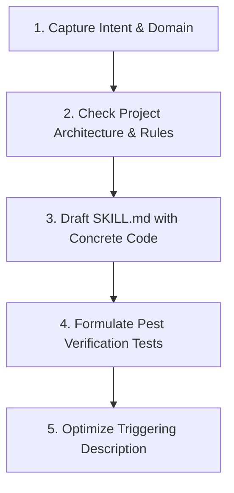

# Skill Creator (Antigravity & Laravel 11 System)

This skill guides the creation, iteration, evaluation, and optimization of custom **Antigravity Skills** tailored specifically for this Laravel 11, PHP 8.2+, Pest 3, and TNVS Payroll codebase.

---

## When to Use This Skill

- Authoring new domain skills in `.agents/skills/<skill-name>/SKILL.md`.
- Refactoring or upgrading existing skills to match current project rules and architectures.
- Defining step-by-step engineering runbooks, statutory deduction guides, or UI patterns.
- Optimizing skill frontmatter descriptions for accurate on-demand activation in Antigravity.
- Creating standardized Pest test scaffolds and feature verification routines for new skills.

---

## Skill Architecture in Antigravity

Custom skills follow the Antigravity Progressive Disclosure model:

```
.agents/skills/<skill-name>/
├── SKILL.md (Required)
│   ├── YAML Frontmatter (name, description)
│   └── Markdown Instructions & Patterns
├── references/ (Optional: deep documentation, statutory tables, API schemas)
├── scripts/    (Optional: automated PHP/Artisan verification helper scripts)
└── templates/  (Optional: Blade, Pest, or Service boilerplate templates)
```

### Progressive Disclosure Levels

1. **Level 1 (Metadata)**: `name` and `description` in YAML frontmatter. Injected into context at start of conversation.
2. **Level 2 (SKILL.md Body)**: Loaded on-demand when the agent reads `SKILL.md` via `view_file`. Keep under 450 lines.
3. **Level 3 (Bundled Resources)**: Specialized deep references in `references/` or scripts in `scripts/`, read only when needed.

---

## The Skill Authoring Workflow



---

### Step 1: Capture Intent & Scope

Identify the exact scope and responsibilities of the skill:
1. **Core Problem**: What task or workflow does this skill solve?
2. **When to Trigger**: What phrases, file edits, or contexts should activate it?
3. **Dependencies**: What models, services, or Laravel packages are involved?
4. **Output Standards**: What files, classes, Blade templates, or Pest tests are produced?

---

### Step 2: System Alignment Checklist

Every skill created for this project **must adhere to these core rules**:

| Rule | Requirement |
| :--- | :--- |
| **Strict Types** | Always require `declare(strict_types=1);` at the top of PHP files. |
| **Skinny Controllers** | Move business logic to `app/Services/` or dedicated Actions. |
| **Form Requests** | Never validate directly in controllers; use Form Requests. |
| **Zero Emojis** | Use pure SVGs (Heroicons) or Tailwind utility classes. Zero Unicode emojis. |
| **Dynamic Configuration** | Load business rates/caps via `CompanySetting::getValue('key', $default)`. |
| **Pest Testing** | Provide complete, copy-pasteable Pest test code blocks with full assertions. |
| **Context7 First** | Consult Context7 for version-accurate Laravel 11 / package behaviors. |

---

### Step 3: Authoring the `SKILL.md` File

Use imperative, instructional phrasing. Structure the `SKILL.md` with clear sections:

```markdown
---
name: [kebab-case-name]
description: >-
  [Action-oriented summary explaining WHAT the skill does and EXACTLY WHEN to use it.
  Include domain keywords and specific trigger contexts.]
---

# [Skill Title] ([Context/Domain])

[1-2 sentence high-level overview of the skill and its purpose.]

---

## When to Use This Skill
- [Trigger condition 1]
- [Trigger condition 2]

---

## Core Principles & Architectural Standards
- [Rule 1 with justification]
- [Rule 2 with justification]

---

## Step-by-Step Implementation Workflow
1. **[Step Name]**: [Instructions]
2. **[Step Name]**: [Instructions]

---

## Concrete Code Examples & Patterns
[Complete, copy-pasteable PHP/Blade/Service code blocks with strict types]

---

## Verification & Pest Test Scaffolding
[Complete, copy-pasteable Pest test suite]

---

## Common Pitfalls & Anti-Patterns
- [Anti-pattern 1]: [Explanation and correct alternative]
```

---

### Step 4: Writing Test Cases & Validation Scaffolds

Every skill with verifiable outputs should provide copy-pasteable Pest test templates:

```php
<?php

declare(strict_types=1);

use App\Models\User;
use Illuminate\Foundation\Testing\RefreshDatabase;

uses(RefreshDatabase::class);

beforeEach(function () {
    $this->user = User::factory()->create();
    $this->actingAs($this->user);
});

test('skill workflow executes with expected domain outcomes and zero regressions', function () {
    // 1. Arrange test fixture and settings
    
    // 2. Act on domain service or controller route
    
    // 3. Assert state changes and database records
});
```

---

### Step 5: Trigger Description Optimization

The `description` field in the frontmatter is the **primary trigger mechanism**. Make descriptions clear, proactive, and context-rich:

- **Weak Description**: `Helps with fuel calculations.`
- **Optimized Description**: `Compute driver fuel reimbursements, validate consumption tolerances against vehicle efficiency ratings, handle receipt proof attachments, and sync approved claims to payroll.`

#### Best Practices for Descriptions:
1. State the exact actions performed (`compute`, `audit`, `refactor`, `generate`).
2. List relevant domain terms (`SSS`, `PhilHealth`, `Pag-IBIG`, `Trip Income`, `CTC`, `Salary Steps`).
3. Explicitly state file types or components affected (`Form Requests`, `Blade views`, `Pest tests`, `Services`).

---

## Step-by-Step Walkthrough: Creating a New Skill

To create a new workspace skill in this project:

1. **Determine Skill Name**: Use lowercase kebab-case (e.g. `statutory-deductions`, `fuel-claims-workflow`).
2. **Create Skill Directory**:
   - Location: `.agents/skills/<skill-name>/`
3. **Write `SKILL.md`**:
   - Write frontmatter and comprehensive instructions.
4. **Verify Discovery**:
   - The skill will be automatically discovered by Antigravity under the workspace customizations root.
